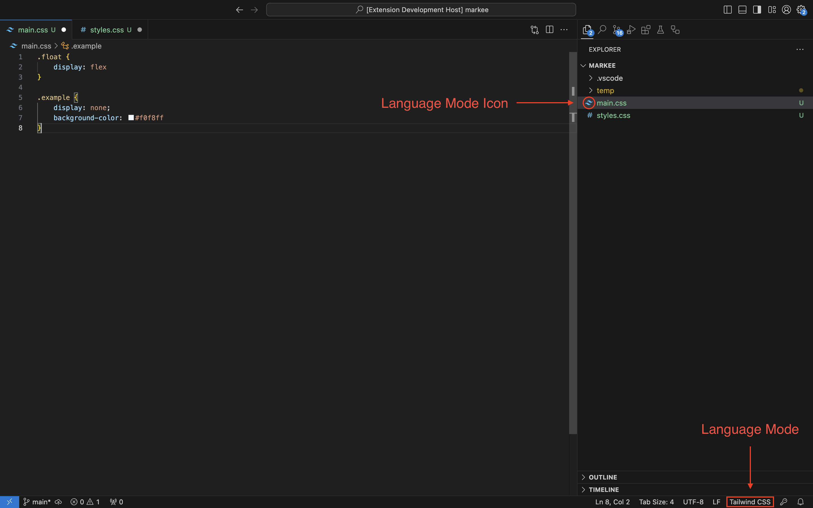

# Tailwind CSS Language Mode Formatter VS Code Extension

**Tailwind CSS Language Mode Formatter** is a Visual Studio Code extension that formats `.css` files when their language mode is set to `Tailwind CSS`.

> This extension was created to address the need for formatting custom CSS within Tailwind projects, as Visual Studio Code does not provide a built-in Tailwind CSS formatter.

---

To use the extention, open the Command Palette and type `>/tailwind Format File`, or press the shortcut `Alt` + `Shift` + `F`.

Ensure you are using the Tailwind CSS Language Mode, check the screenshot below.



## Features

- Formats Tailwind CSS code efficiently.
- Supports CSS **minification** for production-ready code.
- Provides customizable formatting options for indentation, brace placement, and semicolon handling.
- Lightweight and simple to configure. 😊  

---

## Settings

Below are the available settings for the formatter:

| **Setting**                               | **Type**   | **Default**       | **Description**                                                                                          |
|-------------------------------------------|------------|-------------------|----------------------------------------------------------------------------------------------------------|
| `tailwind-css-language-mode-formatter.formatStyle` | `string`  | `"regular"`       | Defines the CSS formatting style. Options: `"regular"` (standard formatting) or `"minimized"` (minified). |
| `tailwind-css-language-mode-formatter.indentSize`  | `number`  | `2`               | Sets the number of spaces for indentation. Accepts any positive integer.                                 |
| `tailwind-css-language-mode-formatter.openBracePlacement` | `string`  | `"end-of-line"`   | Specifies the placement of opening curly braces `{`. Options: `"end-of-line"` or `"separate-line"`.      |
| `tailwind-css-language-mode-formatter.useAutoSemicolon` | `boolean` | `true`            | Automatically inserts a trailing semicolon at the end of each CSS property declaration.                  |
| `tailwind-css-language-mode-formatter.useTabs`      | `boolean` | `false`           | Uses tabs for indentation instead of spaces when set to `true`.                                          |

---

## Example Configuration

To customize the formatter, you can:

- Go to **Settings** → **Extensions** → **Tailwind CSS Language Mode Formatter** and adjust the options there.
- Or add these settings (below) directly to your **VS Code `settings.json`** file,  

```json
{
    "tailwind-css-language-mode-formatter.formatStyle": "regular",
    "tailwind-css-language-mode-formatter.indentSize": 2,
    "tailwind-css-language-mode-formatter.openBracePlacement": "end-of-line",
    "tailwind-css-language-mode-formatter.useAutoSemicolon": true,
    "tailwind-css-language-mode-formatter.useTabs": false
}
```

## Overall Commands:
  - `>/tailwind Format File`

## For more information
My email is lestev.mi@gmail.com

## Credits

This project leverages the following open-source libraries:

- **[cssbeautify](https://github.com/senchalabs/cssbeautify)** – For formatting CSS code.
- **[clean-css](https://github.com/clean-css/clean-css)** – For minifying CSS code.

Thanks for their outstanding work.

## To Support
There's no greater support than if you read this [book](https://m.egwwritings.org/en/book/130.4).